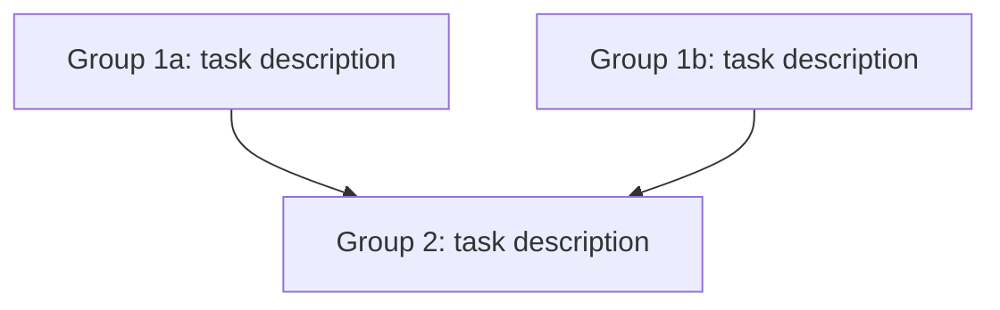

# extract

Analyze the current plan's todos and restructure them into parallelizable groups so they can be built faster using multiple agents.

## Workflow

### Step 1: Read the Plan

- Read the current plan file
- If no plan file is referenced or found, ask the user to provide one or enter plan mode first

### Step 2: Analyze Todo Dependencies

For each todo item, determine:
- **Inputs**: What does this task need to exist or be done before it can start?
- **Outputs**: What does this task produce that other tasks depend on?
- **Conflict risk**: Does this task write to the same files as another task?

Common dependency patterns to look for:
- Package installs (`bun add`, `npm install`) modify `package.json` and `bun.lockb` — nothing else should touch those files concurrently
- Pure file edits with no shared files have zero conflicts and can always run in parallel
- Config scaffolding (creating new files) is safe to parallelize unless two tasks create the same file
- CLI init commands (e.g. `husky init`) need the package installed first

### Step 3: Build the Dependency Graph

Draw a mental (or explicit) dependency graph and identify:
- Tasks with no dependencies on each other → **parallel candidates**
- Tasks that must follow a specific task → **sequential, placed in a later group**
- Tasks that block everything else → **must go first, alone if needed**

### Step 4: Restructure Todos into Groups

Replace the existing todo list with grouped todos using this naming convention:

- Prefix each todo `id` with `g<N>-<short-slug>` where `N` is the group number (1, 2, 3…)
- Prefix each todo `content` with `[Group N]` so the group is visible at a glance
- Tasks in the same group number are safe to run in parallel
- Tasks in group N+1 must wait for all group N tasks to finish

Example structure:
```
- id: g1-fix-source-files    → [Group 1] Fix source files (pure edits, no conflicts)
- id: g1-install-packages    → [Group 1] Install packages (touches package.json only)
- id: g2-setup-scripts       → [Group 2] Add scripts to package.json (needs install done first)
- id: g2-init-git-hooks      → [Group 2] Init husky (needs package installed)
```

### Step 5: Add Execution Map to Plan

After restructuring todos, add or update an **Execution Map** section in the plan body with a flowchart showing the groups and their flow:



### Step 6: Present Summary

Summarize the result:
- How many groups were identified
- Which tasks are parallel within each group
- Which tasks had to be sequenced and why
- Confirm the plan file has been updated

## Naming Guidelines

Avoid generic labels like "WAVE" or "Phase". Use group numbers (`Group 1`, `Group 2`) which are neutral, clear, and sort naturally. The short slug in the id should describe what the group does, not when it runs.

## Important Notes

- **Never merge tasks that write to the same file** — even if they seem unrelated, concurrent writes cause corruption
- **Package installs always get their own group slot** if anything else modifies `package.json` in a later step
- **Do not reorder tasks within a group** — the group only declares parallel safety, not execution order within
- **Update the plan file** with the new todo structure and execution map
- **Do not start building** — this command only restructures the plan

## Error Handling

- **No plan file found**: Ask the user to reference a plan file or enter plan mode first
- **All tasks are sequential**: That's fine — explain why no parallelism is possible and leave todos unchanged
- **Ambiguous dependency**: Default to sequential (put in a later group) and note the uncertainty in the plan
